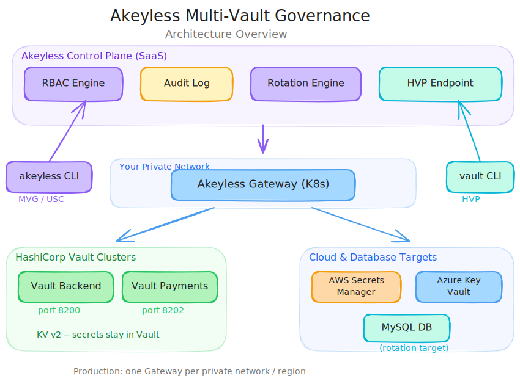

# Akeyless Multi Vault Governance: Centralized Governance Across HashiCorp Vault and Cloud Secrets Managers

## Video

<!-- Embed video here -->

## Introduction

Your CISO asks a simple question: "Who accessed the production database password in the last 90 days?" The answer should take seconds. Instead, it takes days. Your team has to pull audit logs from three separate Vault clusters, cross-reference access records from AWS Secrets Manager, check Azure Key Vault activity logs, and stitch it all together manually in a spreadsheet. The data is incomplete. Some clusters were not configured to ship logs. The answer you deliver comes with caveats. That gap between the question and a confident answer is the governance problem this post solves.

This post is the companion to [a joint webinar](https://www.akeyless.io/webinars/akeyless-multi-vault-governance-for-hashicorp/) with Netser Heruty, Director of Solutions Architecture at Akeyless, and Sam Gabrail, Platform Engineer at TeKanAid Solutions. Netser brings deep Akeyless product expertise and has worked with customers ranging from startups to Fortune 10 enterprises on secrets management strategy. The insights throughout this post draw heavily from that conversation and live demo.

## What You Will Learn

- Automate secret rotation across Azure App Registrations and databases with zero application changes
- Connect Vault using HashiCorp Vault Proxy (HVP) or integrate cloud secrets managers with MVG
- Add centralized RBAC to Vault and cloud secrets managers with no migration
- Capture every access event in one audit trail

## The Governance Gap

### Vault Is Load-Bearing Infrastructure

HashiCorp Vault does not just run in enterprise environments. It gets woven into them. CI/CD pipelines reference Vault endpoints. Kubernetes secrets flow through Vault sidecars. Platform engineers build internal tools that assume Vault is present. Teams securely store everything from database credentials and API keys to SSH keys and encryption keys. Over time, Vault becomes load-bearing infrastructure that dozens of sensitive systems depend on in ways that only surface when you try to change it.

### Migration Is Rarely Achievable

Akeyless had conversations with Gartner about this problem as early as three years ago, and Gartner's strategy explicitly acknowledges that other vaults will remain "for the foreseeable future." Some cloud vendors' built-in services do not even expose an API to work with anything but their native secret manager. Complete migration to a single secrets platform is rarely achievable.

### Fragmented Access Controls and Audit Logs

To be precise, Vault Enterprise can centralize parts of governance when organizations standardize on replication patterns such as Disaster Recovery replication or Performance Replication across regions. In those designs, some of the fragmentation problem is reduced.

The governance gap remains acute, however, in organizations running tens to hundreds of isolated Vault clusters with no replication between them. That pattern is common when different teams own separate environments, when clusters were deployed organically over time, or when the licensing, operational cost, and architectural complexity of replication are not justified for every workload. In that world, role-based access control is still managed per Vault cluster or namespace. Audit logs are fragmented by backend. SIEM integration still requires per-cluster configuration. Managing secrets across cloud environments becomes a manual coordination problem, and ensuring only authorized users can access sensitive credentials requires maintaining access policies independently in every system. A CISO asking "who has had access to the production database credentials in the last 90 days" still gets an answer that involves manually correlating data from multiple systems, if it is possible to answer at all.

### The Real-World Cost

The scale of this problem is not abstract. One Fortune 10 enterprise Netser worked with had thousands of Azure Key Vaults spread across the organization. Their rotation strategy was manual: recurring calendar invites sent to each Key Vault owner reminding them to rotate secrets every 90 days. The compliance overhead alone was enormous, and the actual rotation compliance rate was far below 100 percent.

## Why Native HashiCorp Vault Governance Breaks at Scale

This section is specifically about organizations operating many separate Vault deployments, not a single well-architected replicated Vault Enterprise footprint. Vault Enterprise does offer governance capabilities, and replication can provide a more centralized operating model in some environments. The challenge shows up when companies end up with a fleet of isolated clusters anyway. In that model, Vault's complexity grows with every additional cluster, and the gaps become structural as deployments scale:

- **RBAC is scoped per cluster or namespace, not global.** Each Vault cluster maintains its own policy set. A "read-only auditor" role must be created and maintained independently in every cluster. Policy drift between clusters is inevitable and difficult to detect.
- **Audit logs remain operationally per cluster.** Without Vault Enterprise, there is no built-in mechanism to aggregate audit data. Even with Enterprise, especially across many isolated clusters, shipping logs to a central SIEM requires per-cluster configuration of audit devices, socket endpoints, and log pipelines.
- **No universal control plane across isolated environments.** A policy change intended for all production clusters must still be applied cluster by cluster unless the environment has already been consolidated around enterprise replication and shared operational controls.
- **Cross-cloud or multi-cluster visibility requires stitching logs externally.** Answering "who accessed what, across all clusters, in the last 90 days" means correlating log streams from every cluster in a SIEM, assuming those streams are configured, complete, and formatted consistently.
- **The enterprise version solves part of the problem, not every deployment shape.** Vault Enterprise features like namespace management, Sentinel policies, disaster recovery replication, performance replication, and audit log shipping can address some of these gaps. But organizations with many independently owned clusters still face meaningful licensing cost, rollout effort, and operational complexity if they want to standardize that model everywhere.

The net result is that organizations often know they have a governance gap but accept it because closing it natively would require some combination of Enterprise licensing, replication design, log aggregation infrastructure, and ongoing synchronization of policies across environments. Vendor lock-in compounds the problem: development teams have built automated processes around Vault's secret engines and authentication methods, making the migration cost prohibitive. The "all or nothing" mindset makes things worse: if the only path to governance is either standardizing every cluster on a more centralized Vault Enterprise model or replacing Vault entirely, nothing moves and the gap stays open.

## Govern Without Migrating

Akeyless is a secrets management control plane that can wrap existing infrastructure, including Vault, and govern it without requiring that infrastructure to be replaced. It is not a HashiCorp Vault alternative in the traditional sense; it is a governance layer that works alongside Vault and cloud providers like AWS Secrets Manager and Azure Key Vault.

### Zero-Knowledge Architecture and Distributed Fragments Cryptography

A critical architectural property underpins this: Akeyless uses a zero-knowledge SaaS architecture built on patented Distributed Fragments Cryptography (DFC). Encryption keys are split into fragments distributed across multiple cloud environments and a hardware security module (HSM), ensuring that no single party, including Akeyless, ever holds complete encryption keys. Your sensitive data and credentials remain encrypted and are never exposed in clear text. The control plane enforces enterprise-grade security (RBAC, audit, automatic secret rotation) without ever holding your secret values in the clear.

### How It Works

The security model is straightforward: Vault becomes a secret store that Akeyless governs. The secrets do not move. The Vault cluster does not change. What moves is the control plane. Access decisions, audit logging, and policy enforcement now happen in Akeyless, while the underlying storage and retrieval continue to happen in Vault. This comprehensive approach enables organizations to maintain a strong security posture across cloud environments without compromising security or disrupting existing workflows.

As Netser puts it, "Getting the actual client side, the applications to rewrite the integration or code, that's typically the hardest part with onboarding secrets management use cases." Both MVG and HVP solve that problem. Neither requires applications to change how they retrieve secrets.

### MVG as a Permanent Architecture

MVG is not necessarily an intermediate step on the way to full migration. For many organizations, keeping secrets in their existing backends under Akeyless governance is the permanent architecture. Some Vault instances cannot be replaced. MVG works as a long-term governance layer over those backends indefinitely.

## Two Integration Models

Akeyless provides two mechanisms for governing Vault and adjacent secret stores. They serve different audiences and can be used simultaneously.

### Multi-Vault Governance (MVG)

MVG places a governance layer over your existing secret estate, including both static secrets and sensitive credentials, using Universal Secret Connector objects bound to targets such as HashiCorp Vault, AWS Secrets Manager, and Kubernetes. The Akeyless Gateway, a cloud-native component deployed in your infrastructure (Kubernetes, VM, or Docker), holds persistent connectivity to the backends you want to govern.

When you run `akeyless usc get`, the request authenticates against Akeyless, checks access policies, and if authorized, the Gateway fetches the secret from the backend. The secret value is never copied out permanently. Every operation produces an audit log entry regardless of whether the secret was created through Akeyless or directly in Vault.

Akeyless RBAC operates as an overlay. It does not replace Vault's own access control. For a request to succeed through MVG, it must satisfy both Vault ACL policies and Akeyless access policies. This is defense-in-depth, not policy substitution.

Netser describes MVG as a "bi-directional control plane," and the bi-directional part is a key differentiator. HashiCorp's Vault Secrets Sync pushes from Vault to remote targets but does not give you visibility into the current state of those remote secrets. That one-way model can lead to split-brain scenarios. Akeyless MVG reads and writes directly against the remote backend on every operation, so the Akeyless view always reflects the true state.

### HashiCorp Vault Proxy (HVP)

HVP is an API compatibility layer at `hvp.akeyless.io` that speaks the native Vault OSS HTTP API, enabling organizations to adopt Akeyless governance without changing a single line of code. The operational change is a single environment variable: `VAULT_ADDR=https://hvp.akeyless.io`. Every `vault kv get`, `vault kv put`, and `vault kv list` continues to work exactly as before. Scripts, pipelines, configuration files, and runbooks do not change.

Authentication methods in HVP use a composite access token in the format `<Access Id>..<Access Key>`, set as `VAULT_TOKEN` or written to `~/.vault-token`. From the vault CLI's perspective it is an opaque token string; from Akeyless's perspective it carries identity, ensuring secure access and that every operation is attributed and governed.

HVP uses Akeyless's own KV store as the backend. When a team runs `vault kv put`, the secret lands in Akeyless, governed by Akeyless RBAC and logged in the Akeyless audit trail. This makes HVP the natural tool for teams migrating KV secrets from Vault into Akeyless while keeping the vault CLI as their interface.

HVP also supports dynamic secrets and just-in-time access through 20+ Akeyless producers covering AWS, Azure, GCP, database engines, Kubernetes, public key infrastructure, and more. These integration capabilities extend to external services and third-party services, with newer producers like OpenAI already available and Gemini coming in an upcoming gateway release.

**Licensing:** HVP is not a separate license. It is built into the Akeyless Secrets Management package. MVG is its own license counted per connector (per Key Vault for Azure, per region-account combination for AWS, per Vault instance for HashiCorp Vault).

HVP is also available at your gateway on the `/hvp` path or port 8200 directly. Some Vault community plugins have port 8200 hard-coded, so Akeyless exposes that port to ensure compatibility.

In practice, Netser notes that the more common customer pattern is teams that want to keep their existing clients and tooling talking to their existing vaults, while Akeyless provides centralized storage for access policies, privileged access management, and governance behind the scenes. This multi-cloud flexibility means development teams maintain full control over their existing workflows while gaining centralized secrets rotation, key rotation, and regulatory compliance across every connected backend.

## Architecture at a Glance



The Gateway is the only component inside your network, reducing operational overhead and minimizing security risks. Production deployments typically run one Gateway per private location or region, close to each vault cluster. The single-Gateway setup in this demo is simplified because both Vault instances run in the same network. This architecture eliminates the risk of human error from managing access controls across dozens of individual systems and prevents service disruptions that can occur when remote access configurations drift between environments.

## Automated Rotation and Sync

### The 90-Day Compromise

Automatic secret rotation is consistently under-solved in enterprise security. Compliance frameworks (PCI-DSS, SOC 2, ISO 27001) all require secrets rotation for authorized users who require secrets to access sensitive systems, but traditional implementations involve custom rotation scripts per secret type, each with its own scheduling, error handling, and audit trail. Azure, notably, does not give you built-in native rotation for App Registrations.

As Netser points out, "90 days is also a compromise, something you do just so you don't annoy the users." Once rotation is automated, you can rotate weekly or daily without interfering with workloads. Regulatory requirements are tightening toward shorter intervals.

### How Akeyless Rotated Secrets Work

Akeyless Rotated Secrets let you declare the rotation intent once (which credential, which backend, how often) and Akeyless handles the rest. The Gateway authenticates to the target, generates a new credential, updates it at the source, and syncs the new value into every governed secret store associated with that rotation.

In the demo, this plays out across two backends:

**Azure App Registration rotation:** `demo-akeyless-mvg-target` has its client secret managed by Akeyless. On rotation, Akeyless calls the Microsoft Graph API, generates a new client secret, and syncs it to `demo-app-client-secret` in Azure Key Vault. The consuming application reads from Key Vault and requires zero changes.

**MySQL database rotation with Vault sync:** `akl_demo_user` has its password rotated by Akeyless. The Gateway updates the password in MySQL and immediately syncs the new value to `secret/payments/db-rotated-password` in the payments HashiCorp Vault. Applications reading from Vault always get the current password.

When configuring sync, you can reference an existing secret name in the target backend. The first rotation ensures both sides match. Consuming applications that already read from that path do not need to change anything.

### Bidirectional Sync and Expanding Connectors

MVG is also genuinely bidirectional with no replication lag. Secrets created through Akeyless land directly in Vault KV. Secrets created directly in Vault are immediately visible through MVG. There is no polling interval or sync job. This matters enormously for brownfield deployments: every existing secret is immediately governable the moment you connect a Gateway. HashiCorp's Vault Secrets Sync and CyberArk offer similar concepts, but both implement one-way sync that can lead to split-brain scenarios.

The connector ecosystem continues expanding. The Azure Key Vault connector manages certificates alongside secrets. Conjur support has been added, and GitHub MVG (managing GitHub secrets across organizations, repositories, and environments) is coming soon.

## What We Did in the Demo

The live demo had five acts, driven primarily through the Akeyless console UI.

### Act 1: Multi-Cluster Governance and Bidirectional Sync

We showed the Targets view with two Vault targets, an Azure target, and a MySQL target, all connected through one Gateway. The MVG product view listed all instances and their secrets in one place. We created a secret in Akeyless and confirmed it appeared immediately in Vault. Then we created a new version in the Vault UI and confirmed it appeared instantly in Akeyless. No sync job, no lag.

### Act 2: Automated Rotation and Sync

We triggered Azure App Registration rotation and confirmed the new password appeared in both Akeyless and Azure Key Vault. Then we triggered MySQL rotation and confirmed the new password synced to the payments Vault. Two different credential systems handled by the same rotation engine.

### Act 3: HVP with Zero Disruption

We changed `VAULT_ADDR` to `hvp.akeyless.io` and ran standard `vault kv get` commands. Identical output. We also ran `vault status`, which returned an error, proving this is not actually Vault behind the scenes.

### Act 4: RBAC with One Policy Across Every Cluster

We authenticated as a denied identity and attempted a USC read. Result: 403 Forbidden. One role blocked access across both clusters and every connected secrets manager.

### Act 5: Unified Audit Trail

Every operation from the session appeared in the Akeyless Logs tab: discovery, reads, sync writes, rotation events, and the denied access attempt. All attributed, timestamped, and in one view. These logs can be forwarded to Splunk or other log aggregators.

## Getting Started

The demo runs two Vault dev servers, AWS Secrets Manager, Azure Key Vault, and a MySQL instance, all governed through an Akeyless Gateway on a local Kubernetes cluster. An Akeyless account is required (the free tier at console.akeyless.io is sufficient).

```bash
./demo/setup-vault-dev.sh
./demo/setup-cloud-and-k8s-demo.sh
helm upgrade --install akeyless-gateway akeyless/akeyless-api-gateway \
  --namespace akeyless --values demo/gateway-values.yaml
./demo/akeyless-setup.sh
```

The full source code, setup scripts, and demo commands are available on GitHub at [samgabrail/akeyless-multi-vault-governance](https://github.com/samgabrail/akeyless-multi-vault-governance). The `demo/` folder contains step-by-step instructions and the complete command reference for each demo chapter.

## Next Steps

If your organization is running Vault today and the governance gaps are real, you can close them without a migration project. The Akeyless free tier is available at console.akeyless.io. The current MVG documentation is at docs.akeyless.io/docs/hc-vault-universal-secrets-connector. The HVP documentation is at docs.akeyless.io/docs/hashicorp-vault-proxy. The demo repository contains everything needed to reproduce the demo.

## Frequently Asked Questions

**Does MVG move my secrets out of Vault?**
No. Akeyless reads and writes directly to the governed backend via the Gateway. Your secrets remain physically in Vault, AWS Secrets Manager, or Kubernetes.

**Does Akeyless RBAC replace Vault ACLs?**
No. Akeyless RBAC operates as an overlay. For a request to succeed through MVG, it must satisfy both Vault ACL policies and Akeyless access policies. This is defense-in-depth.

**What happens if Akeyless is unavailable?**
MVG and HVP operations route through the Akeyless control plane. If unavailable, those requests will not be processed. Teams accessing Vault directly are unaffected. Refer to the Gateway documentation for local caching options.

## Webinar Q&A

These questions came from the live audience during the webinar. Answers are from Netser Heruty (Akeyless).

**Is there a separate license to procure MVG and HVP?**
HVP is not a separate license at all. It is built into the Secrets Management package, the exact same secrets management, just another interface to talk to Akeyless. Same client count, nothing new to purchase. MVG is its own license, counted per connector: for Azure, that typically corresponds to the number of Key Vaults you manage; for AWS, the number of regions times accounts (each region is its own separate secret manager); and for HashiCorp Vault, the number of Vault instances. Migration and HVP are entirely part of the same Secrets Management license.

A quick clarification on acronyms: HVP (HashiCorp Vault Proxy) is the Akeyless product. HCP (HashiCorp Cloud Platform) is a separate HashiCorp offering. They are not related.

**Can we directly migrate secrets from any legacy vault to Akeyless?**
Absolutely. Akeyless provides automatic migrations from a variety of secret managers through the Discovery and Migration section in the console. You can migrate your existing secrets onto Akeyless, then use them natively or, if they are HashiCorp Vault secrets, serve them through HVP. Both migration and HVP are entirely part of the same Secrets Management license.

**What is the impact of rotation on just-in-time / dynamic tokens?**
Dynamic secrets are purposely left out of scope for MVG. MVG is for secret types that "sit there," that have to be stored and fetched from a central repository. Dynamic secrets are more like producers or issuers. There is no secret stored as a result. The credential is provided back to the client just-in-time, then it self-revokes. Akeyless does not even keep a copy in a persistent fashion, even within the SaaS, let alone with a remote secret manager. For just-in-time credentials, the recommended approach is to interact directly with Akeyless dynamic secret engines via the Gateway. Akeyless supports 20+ dynamic secret producers (AWS, Azure, GCP, MySQL, Kubernetes, and more), including newer additions like OpenAI, with Gemini coming in an upcoming gateway release.
